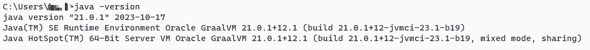
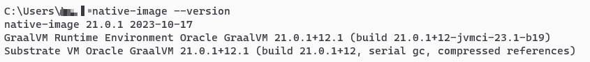
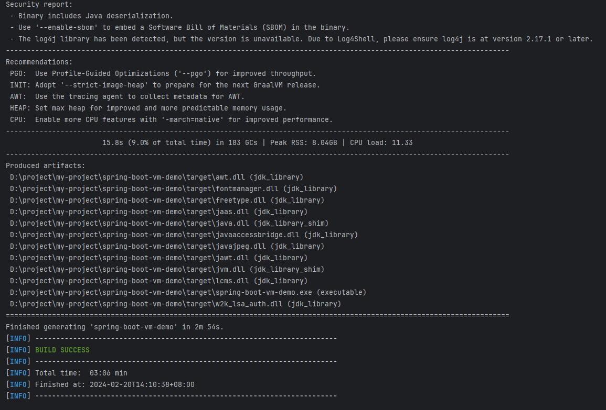
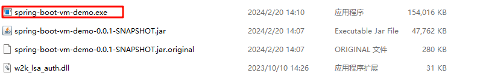
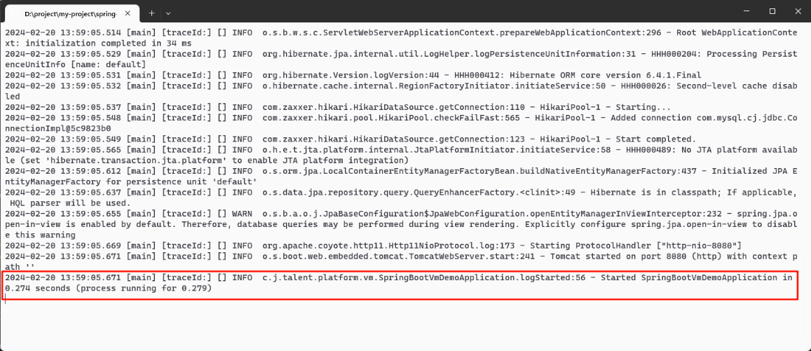
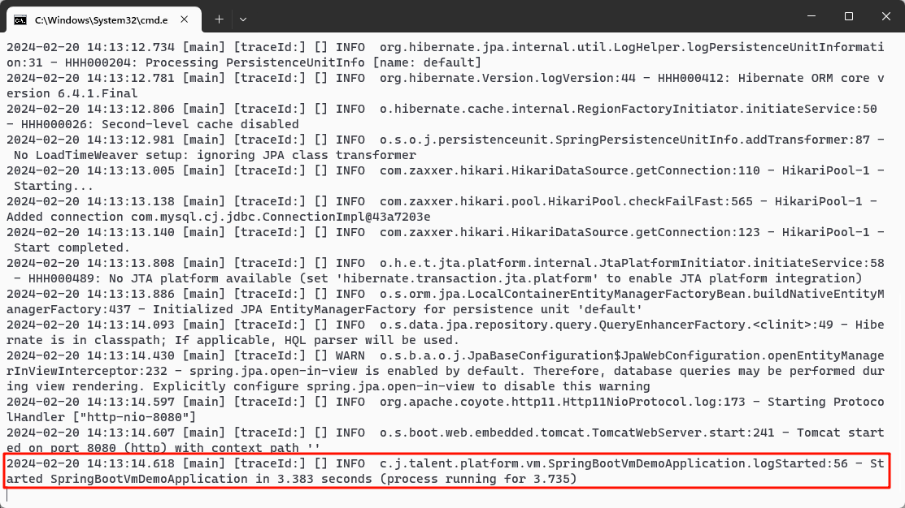

## JDK21 + springboot3 + GraalVM native 21 + virtual Thread


#### 准备环境

* 安装GraalVM
根据系统版本下载
https://www.graalvm.org/downloads/#

* 配置环境变量
将下载文件根据JAVA环境变量配置方法配置系统变量
配置好之后在cmd中执行 java -version  会输出以下内容


检查是否配置成功
native-image --version, 如果配置成功，会输出版本号



#### 准备项目

注意: 
* 不要使用springboot3.2.2版本, 打包后异常如下
https://github.com/spring-projects/spring-data-commons/issues/3025


需要使用3.2.1版本


maven依赖

```xml
  <parent>
  <groupId>org.springframework.boot</groupId>
  <artifactId>spring-boot-starter-parent</artifactId>
  <version>3.2.1</version>
  <relativePath/>
  </parent>


 <build>
    <plugins>
      <plugin>
        <groupId>org.graalvm.buildtools</groupId>
        <artifactId>native-maven-plugin</artifactId>
        <version>0.10.0</version>
      </plugin>
      <plugin>
        <groupId>org.springframework.boot</groupId>
        <artifactId>spring-boot-maven-plugin</artifactId>
        <version>${spring-boot.version}</version>
      </plugin>
    </plugins>
  </build>
```


#### 项目打包

在项目根目录下执行   
```shell
mvn clean native:compile -Pnative
```
成功输出


这个exe就是打包好的文件




#### 启动项目
启动耗时：0.279秒


作为对比,jar包启动耗时：3.735秒
